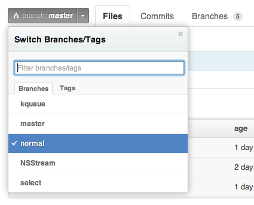
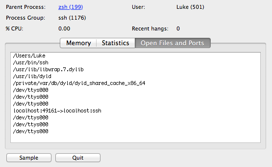
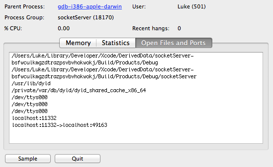
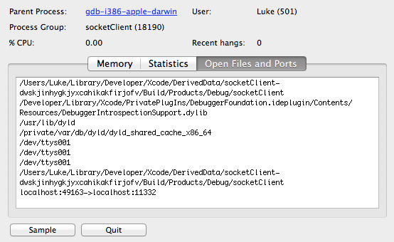

#Mac&iOS Socket编程   

---

###大纲
* 一.Socket简介
* 二.BSD Socket编程准备
	* 1.地址
	* 2.端口
	* 3.网络字节序
	* 4.半相关与全相关
	* 5.网络编程模型
* 三.socket接口编程示例
* 四.使用select
* 五.使用kqueue
* 六.使用流

>注:文档中设计的代码也都在本人github目录下，分别为socketServer和socketClient.对应着各个分支。
>

---

###一.Socket简介   

在UNIX系统中,万物皆文件(Everything is a file)。所有的IO操作都可以看作对文件的IO操作，都遵循着这样的操作模式:打开 -> 读/写 -> 关闭，打开操作（如open函数）获取“文件”使用权，返回文件描述符，后继的操作都通过这个文件描述符来进行。很多系统调用都依赖于文件描述符,它是一个无符号整数，每一个用户进程都对应着一个文件描述符表，通过文件描述符就可以找到对应文件的信息。
在类UNIX平台上，对于控制台的标准输入输出以及标准错误输出都有对应的文件描述符，分别为0,1,2。它们定义在 `unistd.h`中

	#define	 STDIN_FILENO	0	/* standard input file descriptor */
	#define	STDOUT_FILENO	1	/* standard output file descriptor */
	#define	STDERR_FILENO	2	/* standard error file descriptor */   

在Mac系统中，可以通过Activity Monitor来查看某个进程打开的文件和端口。

UNIX内核加入TCP/IP协议的时候，便在系统中引入了一种新的IO操作，只不过由于网络连接的不可靠性，所以网络IO比本地设备的IO复杂很多。这一系列的接口叫做BSD Socket API,当初由伯克利大学研发，最终成为网络开发接口的标准。
网络通信从本质上讲也是进程间通信，只是这两个进程一般在网络中不同计算机上。当然Socket API其实也提供了专门用于本地IPC的使用方式：UNIX Domain Socket，这个这里就不细说了。本文所讲的Socket如无例外，均是说的Internet Socket。

在本地的进程中，每一个进程都可以通过PID来标识，对于网络上的一个计算机中的进程如何标识呢？网络中的计算机可以通过一个IP地址进行标识，一个计算机中的某个进程则可以通过一个无符号整数（端口号）来标识，所以一个网络中的进程可以通过`IP地址+端口号`的方式进行标识。 

###二.BSD Socket编程准备
####1.地址
在程序中，我们如何保存一个地址呢？在 `<sys/socket.h>`中的sockaddr便是描述socket地址的结构体类型.

	/*
 	* [XSI] Structure used by kernel to store most addresses.
 	*/
	struct sockaddr {
		__uint8_t	sa_len;		/* total length */
		sa_family_t	sa_family;	/* [XSI] address family */
		char		sa_data[14];	/* [XSI] addr value (actually larger) */
	};

为了方便设置用语网络通信的socket地址，引入了sockaddr_in结构体（对于UNIX Domain Socket则对应sockaddr_un）

	/*
	 * Socket address, internet style.
	 */
	struct sockaddr_in {
		__uint8_t	sin_len;
		sa_family_t	sin_family;
		in_port_t	sin_port;//得是网络字节序
		struct	in_addr sin_addr;//in_addr存在的原因则是历史原因，其实质是代表一个IP地址的32位整数
		char		sin_zero[8];//bzero之，纯粹是为了兼容sockaddr
	};
	
在实际编程的时候，经常需要将sockaddr_in强制转换成sockaddr类型。    

####2.端口
说到端口我们经常会联想到硬件，在网络编程中的端口其实是一个标识而已，或者说是系统的资源而已。系统提供了端口分配和管理的机制。

####3.网络字节序
谈网络字节序(Endianness)之前我们先说说什么是字节序。字节序又叫端序，就是指计算机中存放 **多字节数据**的字节的顺序。典型的就是数据存放在内存中或者网络传输时的字节的顺序。常用的字节序有大端序(big-endian)，小端序(litle-endian,另还有不常见的混合序middle-endian)。不同的CPU可能会使用不同的字节序，如X86，PDP-11等处理器为小端序，Motorola 6800,PowerPC 970等使用的是大端序。小端序是指低字节位存放在内存地址的低端，高端序是指高位字节存放在内存的低端。
举个例子来说明什么是大端序和小端序：
比如一个4字节的整数 16进制形式为 0x12345678，最左边是高位。

大端序

|低位|> >|> >|高位|
|:----|:----|:----|:----|
|12|34|56|78|

 小端序
 
|低位|> >|> >|高位|
|:----|:----|:----|:----|
|78|56|34|12|

TCP/IP 各层协议将字节序使用的是大端序，我们把TCP/IP协议中使用的字节序称之为网络字节序。
 编程的时候可以使用定义在`sys/_endian.h`中的相关的接口进行本地字节序和网络字节序的互转。

	#define ntohs(x)	__DARWIN_OSSwapInt16(x) // 16位整数 网络字节序转主机字节序
	#define htons(x)	__DARWIN_OSSwapInt16(x) // 16位整数 主机字节序转网络字节序

	#define ntohl(x)	__DARWIN_OSSwapInt32(x)  //32位整数 网络字节序转主机字节序
	#define htonl(x)	__DARWIN_OSSwapInt32(x) //32位整数 主机字节序转网络字节序
	
>以上声明中 n代表netwrok， h代表host ，s代表short，l代表long

如果数据是单字节的话，则其没有字节序的说法了。

####4.半相关与全相关
半相关（half-association）是指一个三元组 `(协议,本地IP地址,本地端口)`,通过这个三元组就可以唯一标识一个网络中的进程,一般用于listening socket。但是实际进行通信的过程，至少需要两个进程，且它们所使用的协议必须一致，所以一个完成的网络通信至少需要一个五元组表示`(协议,本地地址,本地端口,远端地址,远端端口)`，这样的五元组叫做全相关。

####5.网络编程模型
网络存在的本质其实就是网络中个体之间的在某个领域的信息存在不对等性，所以一般情况下总有一些个体为另一些个体提供服务。提供服务器的我们把它叫做服务器，接受服务的叫做客户端。所以在网络编程中，也存在服务器端和客户端之分。

|服务器端|客户端|
|:----------|:----------|
|创建Socket| - |
|将Socket和本地的地址端口绑定| - |
|开始进行侦听|创建一个Socket和服务器的地址并通过它们向服务器发送连接请求|
|握手成功，接受请求，得到一个新的Socket，通过它可以和客户端进行通信|连接成功，客户端的Socket会绑定到系统分配的一个端口上，并可以通过它和服务器端进行通信|

###三.BSD Socket编程详解
下面的例子是一个简单的一对一聊天的程序，分服务器和客户端，且发送消息和接受消息次序固定。
####Server端代码

	#include <stdio.h>
	#include <netinet/in.h>
	#include <sys/socket.h>
	#include <arpa/inet.h>
	#include <string.h>
	
	int main (int argc, const char * argv[])
	{
	    struct sockaddr_in server_addr;
	    server_addr.sin_len = sizeof(struct sockaddr_in);
	    server_addr.sin_family = AF_INET;//Address families AF_INET互联网地址簇
	    server_addr.sin_port = htons(11332);
	    server_addr.sin_addr.s_addr = inet_addr("127.0.0.1");
	    bzero(&(server_addr.sin_zero),8);
	    
	    //创建socket
	    int server_socket = socket(AF_INET, SOCK_STREAM, 0);//SOCK_STREAM 有连接
	    if (server_socket == -1) {
	        perror("socket error");
	        return 1;
	    }
	    
	    //绑定socket：将创建的socket绑定到本地的IP地址和端口，此socket是半相关的，只是负责侦听客户端的连接请求，并不能用于和客户端通信
	    int bind_result = bind(server_socket, (struct sockaddr *)&server_addr, sizeof(server_addr));
	    if (bind_result == -1) {
	        perror("bind error");
	        return 1;
	    }
	    
	    //listen侦听 第一个参数是套接字，第二个参数为等待接受的连接的队列的大小，在connect请求过来的时候,完成三次握手后先将连接放到这个队列中，直到被accept处理。如果这个队列满了，且有新的连接的时候，对方可能会收到出错信息。
	    if (listen(server_socket, 5) == -1) {
	        perror("listen error");
	        return 1;
	    }
	
	    struct sockaddr_in client_address;
	    socklen_t address_len;
	    int client_socket = accept(server_socket, (struct sockaddr *)&client_address, &address_len);
	    //返回的client_socket为一个全相关的socket，其中包含client的地址和端口信息，通过client_socket可以和客户端进行通信。
	    if (client_socket == -1) {
	        perror("accept error");
	        return -1;
	    }
	    
	    char recv_msg[1024];
	    char reply_msg[1024];
	    
	    while (1) {
	        bzero(recv_msg, 1024);
	        bzero(reply_msg, 1024);
	        
	        printf("reply:");
	        scanf("%s",reply_msg);
	        send(client_socket, reply_msg, 1024, 0);
	        
	        long byte_num = recv(client_socket,recv_msg,1024,0);
	        recv_msg[byte_num] = '\0';
	        printf("client said:%s\n",recv_msg);
	
	    }
	    
	    return 0;
	}

####Client端代码

	#include <stdio.h>
	#include <netinet/in.h>
	#include <sys/socket.h>
	#include <arpa/inet.h>
	#include <string.h>
	
	int main (int argc, const char * argv[])
	{
	    struct sockaddr_in server_addr;
	    server_addr.sin_len = sizeof(struct sockaddr_in);
	    server_addr.sin_family = AF_INET;
	    server_addr.sin_port = htons(11332);
	    server_addr.sin_addr.s_addr = inet_addr("127.0.0.1");
	    bzero(&(server_addr.sin_zero),8);
	    
	    int server_socket = socket(AF_INET, SOCK_STREAM, 0);
	    if (server_socket == -1) {
	        perror("socket error");
	        return 1;
	    }
	    char recv_msg[1024];
	    char reply_msg[1024];
	    
	    if (connect(server_socket, (struct sockaddr *)&server_addr, sizeof(struct sockaddr_in))==0) 	{
	    //connect 成功之后，其实系统将你创建的socket绑定到一个系统分配的端口上，且其为全相关，包含服务器端的信息，可以用来和服务器端进行通信。
	        while (1) {
	            bzero(recv_msg, 1024);
	            bzero(reply_msg, 1024);
	            long byte_num = recv(server_socket,recv_msg,1024,0);
	            recv_msg[byte_num] = '\0';
	            printf("server said:%s\n",recv_msg);
	            
	            printf("reply:");
	            scanf("%s",reply_msg);
	            if (send(server_socket, reply_msg, 1024, 0) == -1) {
	                perror("send error");
	            }
	        }
	        
	    }
	    
	    // insert code here...
	    printf("Hello, World!\n");
	    return 0;
	}

上面的服务器端和客户端连接成功之后打开的端口的情况是怎么样的呢？

* 服务器端 ,存在一个用于listen的半相关的socket，一个用于和客户端进行通信的全相关的socket

* 客户端 存在一个用于和服务器端进行通信的全相关的socket

由于accept只运行了一次，所以服务器端一次只能和一个客户端进行通信，且使用的send和recv方法都是阻塞的，所以上面这个例子存在一个问题就是服务器端客户端连接成功之后，发送，接受，发送，接受的次序就被固定了。比如服务器端发送消息之后就等客户端发送消息了，没有接受到客户端的消息之前服务器端是没有办法发送消息的。使用select这个这个系统调用可以解决上面的问题。

###四.使用select
 select这个系统调用，是一种多路复用IO方案，可以同时对多个文件描述符进行监控，从而知道哪些文件描述符可读，可写或者出错，不过select方法是阻塞的，可以设定超时时间。
 select使用的步骤如下:

* 1.创建一个fd_set变量（fd_set实为包含了一个整数数组的结构体），用来存放所有的待检查的文件描述符
* 2.清空fd_set变量，并将需要检查的所有文件描述符加入fd_set
* 3.调用select。若返回-1，则说明出错;返回0,则说明超时，返回正数，则为发生状态变化的文件描述符的个数
* 4.若select返回大于0,则依次查看哪些文件描述符变的可读，并对它们进行处理
* 5.返回步骤2，开始新一轮的检测

若上面的聊天程序使用select进行改写，则是下面这样的

####服务器端

		#include <stdio.h>
		#include <stdlib.h>
		#include <netinet/in.h>
		#include <sys/socket.h>
		#include <arpa/inet.h>
		#include <string.h>
		#include <unistd.h>
		#define BACKLOG 5 //完成三次握手但没有accept的队列的长度
		#define CONCURRENT_MAX 8 //应用层同时可以处理的连接
		#define SERVER_PORT 11332
		#define BUFFER_SIZE 1024
		#define QUIT_CMD ".quit"
		int client_fds[CONCURRENT_MAX];
		int main (int argc, const char * argv[])
		{
		    char input_msg[BUFFER_SIZE];
		    char recv_msg[BUFFER_SIZE];   
		    //本地地址
		    struct sockaddr_in server_addr;
		    server_addr.sin_len = sizeof(struct sockaddr_in);
		    server_addr.sin_family = AF_INET;
		    server_addr.sin_port = htons(SERVER_PORT);
		    server_addr.sin_addr.s_addr = inet_addr("127.0.0.1");
		    bzero(&(server_addr.sin_zero),8);
		    //创建socket
		    int server_sock_fd = socket(AF_INET, SOCK_STREAM, 0);
		    if (server_sock_fd == -1) {
		        perror("socket error");
		        return 1;
		    }
		    //绑定socket
		    int bind_result = bind(server_sock_fd, (struct sockaddr *)&server_addr, sizeof(server_addr));
		    if (bind_result == -1) {
		        perror("bind error");
		        return 1;
		    }
		    //listen
		    if (listen(server_sock_fd, BACKLOG) == -1) {
		        perror("listen error");
		        return 1;
		    }
		    //fd_set
		    fd_set server_fd_set;
		    int max_fd = -1;
		    struct timeval tv;
		    tv.tv_sec = 20;
		    tv.tv_usec = 0;
		    while (1) {
		        FD_ZERO(&server_fd_set);
		        //标准输入
		        FD_SET(STDIN_FILENO, &server_fd_set);
		        if (max_fd < STDIN_FILENO) {
		            max_fd = STDIN_FILENO;
		        }
		        //服务器端socket
		        FD_SET(server_sock_fd, &server_fd_set);
		        if (max_fd < server_sock_fd) {
		            max_fd = server_sock_fd;
		        }
		        //客户端连接
		        for (int i = 0; i < CONCURRENT_MAX; i++) {
		            if (client_fds[i]!=0) {
		                FD_SET(client_fds[i], &server_fd_set);
		                
		                if (max_fd < client_fds[i]) {
		                    max_fd = client_fds[i];
		                }
		            }
		        }
		        int ret = select(max_fd+1, &server_fd_set, NULL, NULL, &tv);
		        if (ret < 0) {
		            perror("select 出错\n");
		            continue;
		        }else if(ret == 0){
		            printf("select 超时\n");
		            continue;
		        }else{
		            //ret为未状态发生变化的文件描述符的个数
		            if (FD_ISSET(STDIN_FILENO, &server_fd_set)) {
		                //标准输入
		                bzero(input_msg, BUFFER_SIZE);
		                fgets(input_msg, BUFFER_SIZE, stdin);
		                //输入 ".quit" 则退出服务器
		                if (strcmp(input_msg, QUIT_CMD) == 0) {
		                    exit(0);
		                }
		                for (int i=0; i<CONCURRENT_MAX; i++) {
		                    if (client_fds[i]!=0) {
		                        send(client_fds[i], input_msg, BUFFER_SIZE, 0);
		                    }
		                }
		            }
		            if (FD_ISSET(server_sock_fd, &server_fd_set)) {
		                //有新的连接请求
		                struct sockaddr_in client_address;
		                socklen_t address_len;
		                int client_socket_fd = accept(server_sock_fd, (struct sockaddr *)&client_address, &address_len);
		                if (client_socket_fd > 0) {
		                    int index = -1;
		                    for (int i = 0; i < CONCURRENT_MAX; i++) {
		                        if (client_fds[i] == 0) {
		                            index = i;
		                            client_fds[i] = client_socket_fd;
		                            break;
		                        }
		                    }
		                    if (index >= 0) {
		                        printf("新客户端(%d)加入成功 %s:%d \n",index,inet_ntoa(client_address.sin_addr),ntohs(client_address.sin_port));
		                    }else{
		                        bzero(input_msg, BUFFER_SIZE);
		                        strcpy(input_msg, "服务器加入的客户端数达到最大值,无法加入!\n");
		                        send(client_socket_fd, input_msg, BUFFER_SIZE, 0);
		                        printf("客户端连接数达到最大值，新客户端加入失败 %s:%d \n",inet_ntoa(client_address.sin_addr),ntohs(client_address.sin_port));
		                    }
		                }
		            }
		            for (int i = 0; i <CONCURRENT_MAX; i++) {
		                if (client_fds[i]!=0) {
		                    if (FD_ISSET(client_fds[i], &server_fd_set)) {
		                        //处理某个客户端过来的消息
		                        bzero(recv_msg, BUFFER_SIZE);
		                        long byte_num = recv(client_fds[i],recv_msg,BUFFER_SIZE,0);
		                        if (byte_num > 0) {
		                            if (byte_num > BUFFER_SIZE) {
		                                byte_num = BUFFER_SIZE;
		                            }
		                            recv_msg[byte_num] = '\0';
		                            printf("客户端(%d):%s\n",i,recv_msg);
		                        }else if(byte_num < 0){
		                            printf("从客户端(%d)接受消息出错.\n",i);
		                        }else{
		                            FD_CLR(client_fds[i], &server_fd_set);
		                            client_fds[i] = 0;
		                            printf("客户端(%d)退出了\n",i);
		                        }
		                    }
		                }
		            }
		        }
		    }
		    return 0;
		}
		
####客户端

		#include <stdio.h>
		#include <netinet/in.h>
		#include <sys/socket.h>
		#include <arpa/inet.h>
		#include <string.h>
		#include <unistd.h>
		#include <stdlib.h>
		
		#define BUFFER_SIZE 1024
		
		int main (int argc, const char * argv[])
		{
		    struct sockaddr_in server_addr;
		    server_addr.sin_len = sizeof(struct sockaddr_in);
		    server_addr.sin_family = AF_INET;
		    server_addr.sin_port = htons(11332);
		    server_addr.sin_addr.s_addr = inet_addr("127.0.0.1");
		    bzero(&(server_addr.sin_zero),8);
		    
		    int server_sock_fd = socket(AF_INET, SOCK_STREAM, 0);
		    if (server_sock_fd == -1) {
		        perror("socket error");
		        return 1;
		    }
		    char recv_msg[BUFFER_SIZE];
		    char input_msg[BUFFER_SIZE];
		    
		    if (connect(server_sock_fd, (struct sockaddr *)&server_addr, sizeof(struct sockaddr_in))==0) {
		        fd_set client_fd_set;
		        struct timeval tv;
		        tv.tv_sec = 20;
		        tv.tv_usec = 0;
		
		        
		        while (1) {
		            FD_ZERO(&client_fd_set);
		            FD_SET(STDIN_FILENO, &client_fd_set);
		            FD_SET(server_sock_fd, &client_fd_set);
		            
		            int ret = select(server_sock_fd + 1, &client_fd_set, NULL, NULL, &tv);
		            if (ret < 0 ) {
		                printf("select 出错!\n");
		                continue;
		            }else if(ret ==0){
		                printf("select 超时!\n");
		                continue;
		            }else{
		                if (FD_ISSET(STDIN_FILENO, &client_fd_set)) {
		                    bzero(input_msg, BUFFER_SIZE);
		                    fgets(input_msg, BUFFER_SIZE, stdin);
		                    if (send(server_sock_fd, input_msg, BUFFER_SIZE, 0) == -1) {
		                        perror("发送消息出错!\n");
		                    }
		                }
		                
		                if (FD_ISSET(server_sock_fd, &client_fd_set)) {
		                    bzero(recv_msg, BUFFER_SIZE);
		                    long byte_num = recv(server_sock_fd,recv_msg,BUFFER_SIZE,0);
		                    if (byte_num > 0) {
		                        if (byte_num > BUFFER_SIZE) {
		                            byte_num = BUFFER_SIZE;
		                        }
		                        recv_msg[byte_num] = '\0';
		                        printf("服务器:%s\n",recv_msg);
		                    }else if(byte_num < 0){
		                        printf("接受消息出错!\n");
		                    }else{
		                        printf("服务器端退出!\n");
		                        exit(0);
		                    }
		
		                }
		            }
		        }
		        
		    }
		    
		    return 0;
		}
		
		

当然select也有其局限性。当fd_set中的文件描述符较少，或者大都数文件描述符都比较活跃的时候，select的效率还是不错的。Mac系统中已经定义了fd_set 最大可以容纳的文件描述符的个数为1024

	//sys/_structs.h
	#define	__DARWIN_FD_SETSIZE	1024
	/////////////////////////////////////////////
	//Kernel.framework sys/select.h
	#define	FD_SETSIZE	__DARWIN_FD_SETSIZE
	
每一次select 调用的时候，都涉及到user space和kernel space的内存拷贝，且会对fd_set中的所有文件描述符进行遍历，如果所有的文件描述符均不满足，且没有超时，则当前进程便开始睡眠，直到超时或者有文件描述符状态发生变化。当文件描述符数量较大的时候，将耗费大量的CPU时间。所以后来有新的方案出现了，如windows2000引入的IOCP，Linux Kernel 2.6中成熟的epoll，FreeBSD4.x引入的kqueue。

###五.使用kqueue
Mac是基于BSD的内核，所使用的是kqueue（kernel event notification mechanism，详细内容可以Mac中 `man 2 kqueue`），kqueue比select先进的地方就在于使用事件触发的机制，且其调用无需每次对所有的文件描述符进行遍历，返回的时候只返回需要处理的事件，而不像select中需要自己去一个个通过FD_ISSET检查。   
kqueue默认的触发方式是level 水平触发，可以通过设置event的flag为`EV_CLEAR` 使得这个事件变为边沿触发,可能epoll的触发方式无法细化到单个event，需要查证。

kqueue中涉及两个系统调用，kqueue()和kevent()

* kqueue() 创建kernel级别的事件队列，并返回队列的文件描述符
* kevent() 往事件队列中加入订阅事件，或者返回相关的事件数组

kqueue使用的流程一般如下：

* 创建kqueue
* 创建struct kevent变量（注意这里的kevent是结构体类型名），可以通过EV_SET这个宏提供的快捷方式进行创建
* 通过kevent系统调用将创建好的kevent结构体变量加入到kqueue队列中，完成对指定文件描述符的事件的订阅
* 通过kevent系统调用获取满足条件的事件队列，并对每一个事件进行处理

		#include <stdio.h>
		#include <stdlib.h>
		#include <netinet/in.h>
		#include <sys/socket.h>
		#include <sys/event.h>
		#include <sys/types.h>
		#include <sys/time.h>
		#include <arpa/inet.h>
		#include <string.h>
		#include <unistd.h>
		#define BACKLOG 5 //完成三次握手但没有accept的队列的长度
		#define CONCURRENT_MAX 8 //应用层同时可以处理的连接
		#define SERVER_PORT 11332
		#define BUFFER_SIZE 1024
		#define QUIT_CMD ".quit"
		int client_fds[CONCURRENT_MAX];
		struct kevent events[10];//CONCURRENT_MAX + 2
		int main (int argc, const char * argv[])
		{
		    char input_msg[BUFFER_SIZE];
		    char recv_msg[BUFFER_SIZE];
		    //本地地址
		    struct sockaddr_in server_addr;
		    server_addr.sin_len = sizeof(struct sockaddr_in);
		    server_addr.sin_family = AF_INET;
		    server_addr.sin_port = htons(SERVER_PORT);
		    server_addr.sin_addr.s_addr = inet_addr("127.0.0.1");
		    bzero(&(server_addr.sin_zero),8);
		    //创建socket
		    int server_sock_fd = socket(AF_INET, SOCK_STREAM, 0);
		    if (server_sock_fd == -1) {
		        perror("socket error");
		        return 1;
		    }
		    //绑定socket
		    int bind_result = bind(server_sock_fd, (struct sockaddr *)&server_addr, sizeof(server_addr));
		    if (bind_result == -1) {
		        perror("bind error");
		        return 1;
		    }
		    //listen
		    if (listen(server_sock_fd, BACKLOG) == -1) {
		        perror("listen error");
		        return 1;
		    }
		    struct timespec timeout = {10,0};
		    //kqueue
		    int kq = kqueue();
		    if (kq == -1) {
		        perror("创建kqueue出错!\n");
		        exit(1);
		    }
		    struct kevent event_change;
		    EV_SET(&event_change, STDIN_FILENO, EVFILT_READ, EV_ADD, 0, 0, NULL);
		    kevent(kq, &event_change, 1, NULL, 0, NULL);
		    EV_SET(&event_change, server_sock_fd, EVFILT_READ, EV_ADD, 0, 0, NULL);
		    kevent(kq, &event_change, 1, NULL, 0, NULL);
		    while (1) {
		        int ret = kevent(kq, NULL, 0, events, 10, &timeout);
		        if (ret < 0) {
		            printf("kevent 出错!\n");
		            continue;
		        }else if(ret == 0){
		            printf("kenvent 超时!\n");
		            continue;
		        }else{
		            //ret > 0 返回事件放在events中
		            for (int i = 0; i < ret; i++) {
		                struct kevent current_event = events[i];
		                //kevent中的ident就是文件描述符
		                if (current_event.ident == STDIN_FILENO) {
		                    //标准输入
		                    bzero(input_msg, BUFFER_SIZE);
		                    fgets(input_msg, BUFFER_SIZE, stdin);
		                    //输入 ".quit" 则退出服务器
		                    if (strcmp(input_msg, QUIT_CMD) == 0) {
		                        exit(0);
		                    }
		                    for (int i=0; i<CONCURRENT_MAX; i++) {
		                        if (client_fds[i]!=0) {
		                            send(client_fds[i], input_msg, BUFFER_SIZE, 0);
		                        }
		                    }
		                }else if(current_event.ident == server_sock_fd){
		                    //有新的连接请求
		                    struct sockaddr_in client_address;
		                    socklen_t address_len;
		                    int client_socket_fd = accept(server_sock_fd, (struct sockaddr *)&client_address, &address_len);
		                    if (client_socket_fd > 0) {
		                        int index = -1;
		                        for (int i = 0; i < CONCURRENT_MAX; i++) {
		                            if (client_fds[i] == 0) {
		                                index = i;
		                                client_fds[i] = client_socket_fd;
		                                break;
		                            }
		                        }
		                        if (index >= 0) {
		                            EV_SET(&event_change, client_socket_fd, EVFILT_READ, EV_ADD, 0, 0, NULL);
		                            kevent(kq, &event_change, 1, NULL, 0, NULL);
		                            printf("新客户端(fd = %d)加入成功 %s:%d \n",client_socket_fd,inet_ntoa(client_address.sin_addr),ntohs(client_address.sin_port));
		                        }else{
		                            bzero(input_msg, BUFFER_SIZE);
		                            strcpy(input_msg, "服务器加入的客户端数达到最大值,无法加入!\n");
		                            send(client_socket_fd, input_msg, BUFFER_SIZE, 0);
		                            printf("客户端连接数达到最大值，新客户端加入失败 %s:%d \n",inet_ntoa(client_address.sin_addr),ntohs(client_address.sin_port));
		                        }
		                    }
		                }else{
		                    //处理某个客户端过来的消息
		                    bzero(recv_msg, BUFFER_SIZE);
		                    long byte_num = recv((int)current_event.ident,recv_msg,BUFFER_SIZE,0);
		                    if (byte_num > 0) {
		                        if (byte_num > BUFFER_SIZE) {
		                            byte_num = BUFFER_SIZE;
		                        }
		                        recv_msg[byte_num] = '\0';
		                        printf("客户端(fd = %d):%s\n",(int)current_event.ident,recv_msg);
		                    }else if(byte_num < 0){
		                        printf("从客户端(fd = %d)接受消息出错.\n",(int)current_event.ident);
		                    }else{
		                        EV_SET(&event_change, current_event.ident, EVFILT_READ, EV_DELETE, 0, 0, NULL);
		                        kevent(kq, &event_change, 1, NULL, 0, NULL);
		                        close((int)current_event.ident);
		                        for (int i = 0; i < CONCURRENT_MAX; i++) {
		                            if (client_fds[i] == (int)current_event.ident) {
		                                client_fds[i] = 0;
		                                break;
		                            }
		                        }
		                        printf("客户端(fd = %d)退出了\n",(int)current_event.ident);
		                    }
		                }
		            }
		        }
		    }
		    return 0;
		}

其实kqueue的应用场景非常的广阔，可以监控文件系统中文件的变化（对文件变化的事件可以粒度非常的细，具体可以查看kqueue的手册），监控系统进程的生命周期。GCD的事件处理便是建立在kqueue之上的。

###六.使用Streams
使用Objective-C的一大优点便是面向对象编程，使得逻辑抽象得更加优美，更加符合人类思维。
一开始说过，无论是对于文件的操作或者对于网络的操作，本质上都是IO操作，无非写数据和读数据，可以对这种输入输出进行抽象，抽象成输入流和输出流， **从输入流中读取数据，往输出流中写数据**。
Cocoa中的NSInputStream和NSOutputStream便是输入流和输出流的抽象，它们的实现分别基于CoreFoundation中的CFReadStream和CFWriteStream。
输入输出流对runloop有很好的支持。
NSInputStream和CFReadStream以及NSOutputStream和CFWriteStream之间可以通过 "toll-free bridging"实现无缝的类型转换。
CoreFoundation中的CFStream提供了输入输出流和CFSocket绑定的函数。
这样便可以通过输入输出流和远端进行通信了。

首先通过XCode创建一个Foundation(C的也行，但是你得将`main.c` 改成`main.m`)的命令行项目.
创建一个ChatServer的类，包含一个run的方法。在Cocoa的程序中有一点是和C语言不同的，你无需自己去写一个死循环充当runloop，框架本身就对runloop进行了支持，需要做的就是将事件源加入到当前线程的runloop中，然后启动runloop。
所以在run方法中，创建好用于侦听连接请求的socket，socket有对应的处理连接accept的回调函数，以及把它封装成runloop的输入源，加入到当前runloop。
我们还得从标准输入获取需要发送消息，所以使用了CFFileDescriptor，它是文件描述符的objc的封装，加入了runloop的支持，通过它可以将标准输入以输入源的方法加入到当前runloop，当标准输入缓冲区有数据可读的时候，设置好的回调函数便会被调用。
最后启动runloop。

**ChatServer中的run方法**

	- (BOOL)run:(NSError **)error{
	    BOOL successful = YES;
	    CFSocketContext socketCtxt = {0, self, NULL, NULL, NULL};
	    _socket = CFSocketCreate(kCFAllocatorDefault, PF_INET, SOCK_STREAM, 
	                             IPPROTO_TCP, 
	                             kCFSocketAcceptCallBack,
	                             (CFSocketCallBack)&SocketConnectionAcceptedCallBack,
	                             &socketCtxt);
	    if (NULL == _socket) {
	        if (nil != error) {
	            *error = [[NSError alloc] 
	                      initWithDomain:ServerErrorDomain
	                      code:kServerNoSocketsAvailable
	                      userInfo:nil];
	        }
	        successful = NO;
	    }
	    if(YES == successful) {
	        // enable address reuse
	        int yes = 1;
	        setsockopt(CFSocketGetNative(_socket), 
	                   SOL_SOCKET, SO_REUSEADDR,
	                   (void *)&yes, sizeof(yes));
	        uint8_t packetSize = 128;
	        setsockopt(CFSocketGetNative(_socket),
	                   SOL_SOCKET, SO_SNDBUF,
	                   (void *)&packetSize, sizeof(packetSize));
	        setsockopt(CFSocketGetNative(_socket),
	                   SOL_SOCKET, SO_RCVBUF,
	                   (void *)&packetSize, sizeof(packetSize));
	        struct sockaddr_in addr4;
	        memset(&addr4, 0, sizeof(addr4));
	        addr4.sin_len = sizeof(addr4);
	        addr4.sin_family = AF_INET;
	        addr4.sin_port = htons(CHAT_SERVER_PORT); 
	        addr4.sin_addr.s_addr = htonl(INADDR_ANY);
	        NSData *address4 = [NSData dataWithBytes:&addr4 length:sizeof(addr4)];
	        if (kCFSocketSuccess != CFSocketSetAddress(_socket, (CFDataRef)address4)) {
	            if (error) *error = [[NSError alloc] 
	                                 initWithDomain:ServerErrorDomain
	                                 code:kServerCouldNotBindToIPv4Address
	                                 userInfo:nil];
	            if (_socket) CFRelease(_socket);
	            _socket = NULL;
	            successful = NO;
	        } else {
	            // now that the binding was successful, we get the port number 
	            NSData *addr = [(NSData *)CFSocketCopyAddress(_socket) autorelease];
	            memcpy(&addr4, [addr bytes], [addr length]);
	            self.port = ntohs(addr4.sin_port);
	            // 将socket 输入源加入到当前的runloop
	            CFRunLoopRef cfrl = CFRunLoopGetCurrent();
	            CFRunLoopSourceRef source4 = CFSocketCreateRunLoopSource(kCFAllocatorDefault, _socket, 0);
	            CFRunLoopAddSource(cfrl, source4, kCFRunLoopDefaultMode);
	            CFRelease(source4);	            
	            //标准输入，当在命令行中输入时，回调函数便会被调用
	            CFFileDescriptorContext context = {0,self,NULL,NULL,NULL};
	            CFFileDescriptorRef stdinFDRef = CFFileDescriptorCreate(kCFAllocatorDefault, STDIN_FILENO, true, FileDescriptorCallBack, &context);
	            CFFileDescriptorEnableCallBacks(stdinFDRef,kCFFileDescriptorReadCallBack);
	            CFRunLoopSourceRef stdinSource = CFFileDescriptorCreateRunLoopSource(kCFAllocatorDefault, stdinFDRef, 0);
	            CFRunLoopAddSource(cfrl, stdinSource, kCFRunLoopDefaultMode);
	            CFRelease(stdinSource);
	            CFRelease(stdinFDRef); 
	            CFRunLoopRun();
	        }
		}
	    return successful;
	}
	

当有客户端连接请求过来时，	SocketConnectionAcceptedCallBack这个回调函数会被调用，根据新的全相关的socket，生成输入输出流，并设置输入输出流的delegate方法，将其添加到当前的runloop，这样流中有数据过来的时候，delegate方法会被调用。

**SocketConnectionAcceptedCallBack函数**

	static void SocketConnectionAcceptedCallBack(CFSocketRef socket, 
	                                             CFSocketCallBackType type, 
	                                             CFDataRef address, 
	                                             const void *data, void *info) {
	    ChatServer *theChatServer = (ChatServer *)info;
	    if (kCFSocketAcceptCallBack == type) { 
	        // 摘自kCFSocketAcceptCallBack的文档，New connections will be automatically accepted and the callback is called with the data argument being a pointer to a CFSocketNativeHandle of the child socket. This callback is usable only with listening sockets.
	        CFSocketNativeHandle nativeSocketHandle = *(CFSocketNativeHandle *)data;
	        // create the read and write streams for the connection to the other process
	        CFReadStreamRef readStream = NULL;
			CFWriteStreamRef writeStream = NULL;
	        CFStreamCreatePairWithSocket(kCFAllocatorDefault, nativeSocketHandle,
	                                     &readStream, &writeStream);
	        if(NULL != readStream && NULL != writeStream) {
	            CFReadStreamSetProperty(readStream, 
	                                    kCFStreamPropertyShouldCloseNativeSocket,
	                                    kCFBooleanTrue);
	            CFWriteStreamSetProperty(writeStream, 
	                                     kCFStreamPropertyShouldCloseNativeSocket,
	                                     kCFBooleanTrue);
	            NSInputStream *inputStream = (NSInputStream *)readStream;//toll-free bridging
	            NSOutputStream *outputStream = (NSOutputStream *)writeStream;//toll-free bridging
	            inputStream.delegate = theChatServer;
	            [inputStream scheduleInRunLoop:[NSRunLoop currentRunLoop] forMode:NSDefaultRunLoopMode];
	            [inputStream open];
	            outputStream.delegate = theChatServer;
	            [outputStream scheduleInRunLoop:[NSRunLoop currentRunLoop] forMode:NSDefaultRunLoopMode];
	            [outputStream open];
	            Client *aClient = [[Client alloc] init];
	            aClient.inputStream = inputStream;
	            aClient.outputStream = outputStream;
	            aClient.sock_fd = nativeSocketHandle;
	            [theChatServer.clients setValue:aClient  
	                                     forKey:[NSString stringWithFormat:@"%d",inputStream]];
	            NSLog(@"有新客户端(sock_fd=%d)加入",nativeSocketHandle);
	        } else {
	            close(nativeSocketHandle);
	        }
	        if (readStream) CFRelease(readStream);
	        if (writeStream) CFRelease(writeStream);
	    }
	}
	
当客户端有数据传过来时，相应的NSInputStream的delegate方法被调用
	
		- (void) stream:(NSStream*)stream handleEvent:(NSStreamEvent)eventCode {
	    switch (eventCode) {
	        case NSStreamEventOpenCompleted: {
	            break;
	        }
	        case NSStreamEventHasBytesAvailable: {
	            Client *client = [self.clients objectForKey:[NSString stringWithFormat:@"%d",stream]];
	            NSMutableData *data = [NSMutableData data];
	            uint8_t *buf = calloc(128, sizeof(uint8_t));
	            NSUInteger len = 0;
	            while([(NSInputStream*)stream hasBytesAvailable]) {
	                len = [(NSInputStream*)stream read:buf maxLength:128];
	                if(len > 0) {
	                    [data appendBytes:buf length:len];
	                }
	            }
	            free(buf);
	            if ([data length] == 0) {
	                //客户端退出
	                NSLog(@"客户端(sock_fd=%d)退出",client.sock_fd);
	                [self.clients removeObjectForKey:[NSString stringWithFormat:@"%d",stream]];
	                close(client.sock_fd);
	            }else{
	                NSLog(@"收到客户端(sock_fd=%d)消息:%@",client.sock_fd,[[[NSString alloc] initWithData:data encoding:NSUTF8StringEncoding] autorelease]);
	            }
	            break;
	        }
	        case NSStreamEventHasSpaceAvailable: {
	            break;
	        }
	        case NSStreamEventEndEncountered: {
	            break;
	        }
	        case NSStreamEventErrorOccurred: {
	            break;
	        }
	        default:
	            break;
	    }
	}
	
当在debug窗口中输入内容并回车时，标准输入缓冲区中便有数据了，这个时候回调函数FileDescriptorCallBack将被调用，处理标准输入。

	static void FileDescriptorCallBack(CFFileDescriptorRef f,
	                                   CFOptionFlags callBackTypes,
	                                   void *info){
	    int fd = CFFileDescriptorGetNativeDescriptor(f);
	    ChatServer *theChatServer = (ChatServer *)info;
	    if (fd == STDIN_FILENO) {
	        NSData *inputData = [[NSFileHandle fileHandleWithStandardInput] availableData];
	        NSString *inputString = [[[NSString alloc] initWithData:inputData encoding:NSUTF8StringEncoding] autorelease];
	        NSLog(@"准备发送消息:%@",inputString);
	        for (Client *client in [theChatServer.clients allValues]) {
	            [client.outputStream write:[inputData bytes] maxLength:[inputData length]];
	        }
	        //处理完数据之后必须重新Enable 回调函数
	        CFFileDescriptorEnableCallBacks(f,kCFFileDescriptorReadCallBack);
	    }
	}